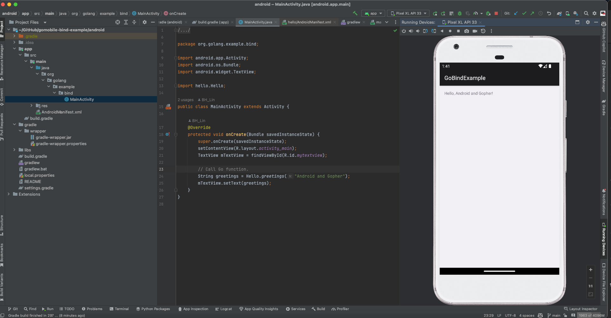
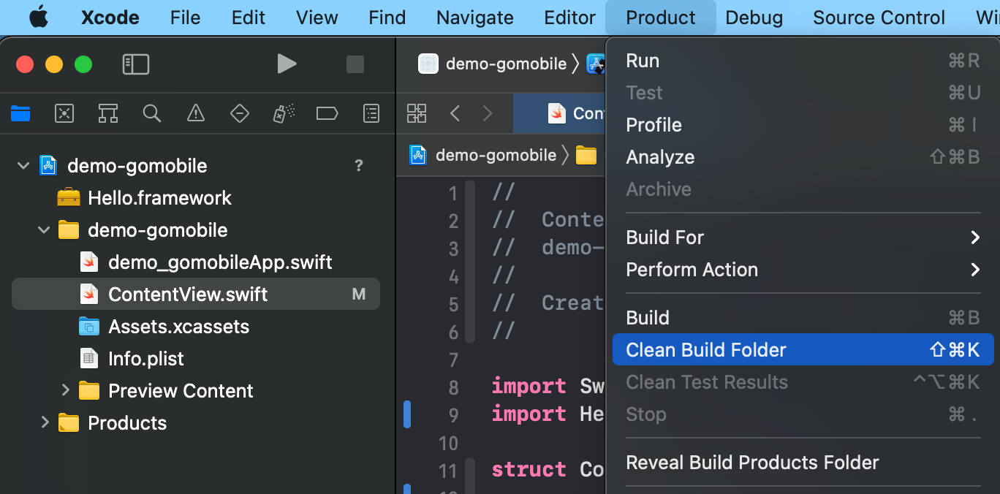
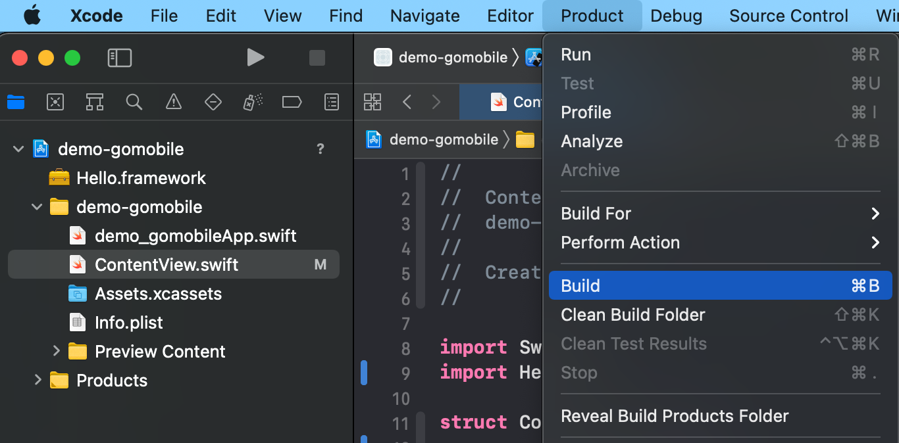
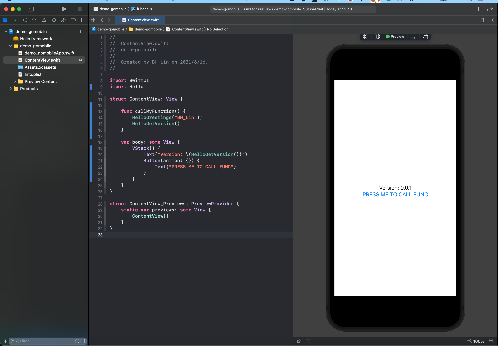

  
gomobile-bind-example
================================================

- [gomobile-bind-example](#gomobile-bind-example)
- [Android](#android)
  - [Build library](#build-library)
  - [Build the app to see the result](#build-the-app-to-see-the-result)
- [iOS](#ios)
  - [Build framework](#build-framework)


# Android
## Build library
- build Android library by following command 
issue:  https://stackoverflow.com/questions/75671126/gomobile-bind-gomobile-android-ndk-home-specifies-android-sdk-ndk-25-2-9519#77686965
```shellscript
cd hello; gomobile bind -target=android -androidapi 21 

```
- Copy the Hello.xcframework you built to ios project 
```shellscript
rm -rf ../android/libs/hello.aar; 
mv hello.aar ../android/libs/hello.aar
```

## Build the app to see the result



# iOS
## Build framework
- Please modify the code in folder "hello"  
- build iOS framework by following command 
```shellscript
cd hello; gomobile bind -target=ios
```
- Copy the Hello.xcframework you built to ios project 
```shellscript
rm -rf ../ios/Hello.xcframework; 
mv Hello.xcframework ../ios/Hello.framework
```

note: Idk why Xcode reference to hello/Hello.xcframework instead of copied version inside ios folder, dont run 'rm -rf' and 'mv' command above and Xcode will build successfully.

- Clean iOS project 

- Re-build iOS project 


then, you are good to go. 


